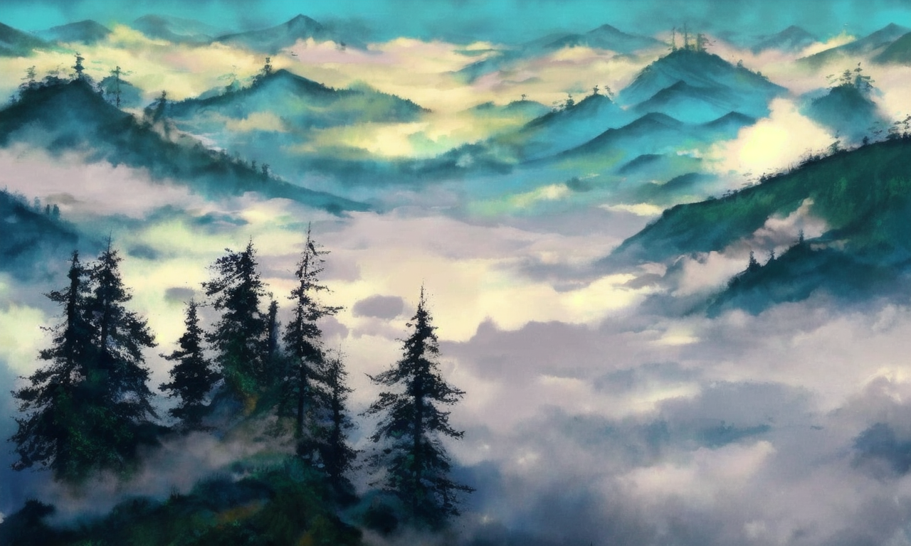

# AIGC_project

## Description:

This is a personal naive AIGC project, which contain some interesting results that the author tried to make after seeing interesting videos or blogs. Specifically, this project contains the results of LoRa training, personalized QR code generation, and personalized portrait photo generation

## LoRa

**Ink landscape:**

  

## Personalized QR code

**Realistic:**

     

**Anime:**

     

## Personalized portrait

  

##reference:

:sparkles: https://www.youtube.com/watch?v=zOMxSlRyuVk

:sparkles:https://zhuanlan.zhihu.com/p/654184382

:sparkles:https://github.com/Akegarasu/lora-scripts
